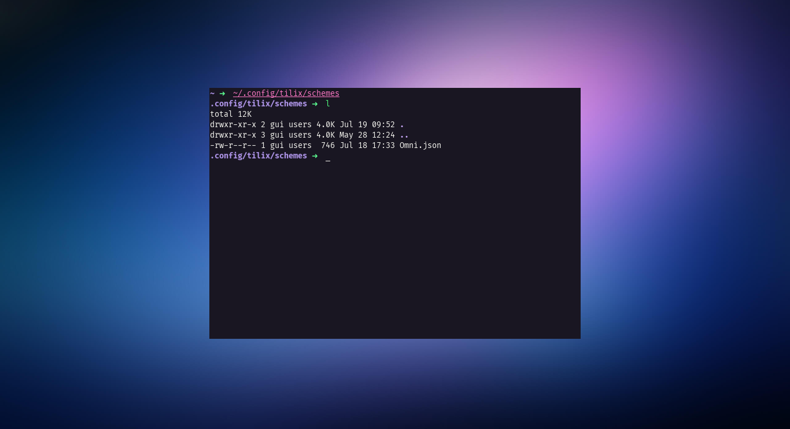

<h1 align="center">
  <br>
  
  <br>
  Omni for <a href="https://gnunn1.github.io/tilix-web/">X</a>
  <br>
</h1>

<p align="center">
  <strong>Dark theme for <a href="https://gnunn1.github.io/tilix-web/">X</a></strong>
</p>

<p align="center">
  

  
</p>

<p align="center">
  <a href="#install">Install</a> •
  <a href="#team">Team</a> •
  <a href="#license">License</a>
</p>

<p align="center">
  
</p>

## Install

All instructions can be found at [INSTALL.md](./INSTALL.md). 

## Team

This theme is maintained by the following person(s) and a bunch of

#### Install using config file

Clone this repo

```sh
git clone https://github.com/GuiLra/tilix-omni ~/tilix
```

Copy `Omni.json` under `~/.config/tilix/schemes` (first create directory if not exist)

```sh
cp -r ~/tilix/Omni.json ~/.config/tilix/schemes
```

#### Activating theme

1.  Restart tilix 
2.  Go to `View -> Preferences` and select your Tilix profile
3.  Select `Colors` tab
4.  Select `Omni` from dropdown
  
## License

MIT License
